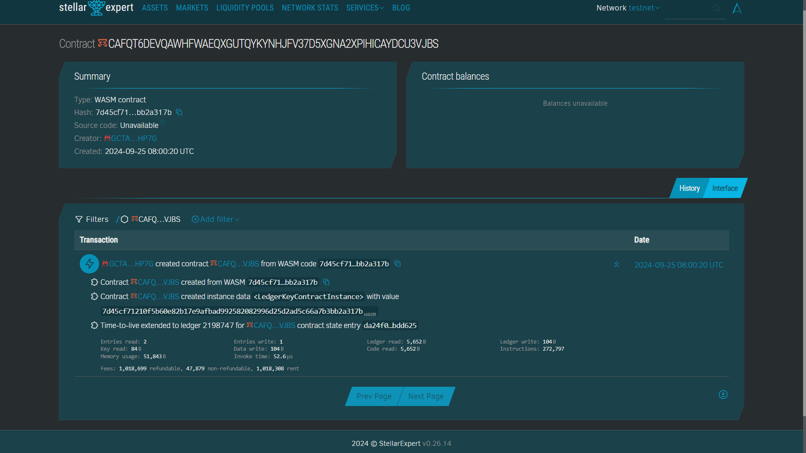

##### Deployed smartcontract address: CAFQT6DEVQAWHFWAEQXGUTQYKYNHJFV37D5XGNA2XPIHICAYDCU3VJBS

# Decentralized Cloud Computing

## Project Title
Decentralized Cloud Computing

## Project Description
The Decentralized Cloud Computing platform is a decentralized application (dApp) built on the Stellar blockchain. It enables users to rent out their unused computing resources or utilize computing power from others. Smart contracts manage resource allocation, service agreements, and payments, ensuring a secure, transparent, and trustless environment for cloud computing services. All transactions are conducted using Lumens (XLM), Stellar's native cryptocurrency.

## Project Vision
Our vision is to create a decentralized and open marketplace for cloud computing resources where individuals and businesses can efficiently and securely share computing power. By utilizing blockchain technology and smart contracts, we aim to eliminate intermediaries, reduce costs, and provide transparent service agreements. This platform empowers both resource providers and users by offering a decentralized alternative to traditional cloud service providers.

## Key Features
- **Resource Allocation**: Smart contracts automatically allocate computing resources based on user requirements and provider availability.
- **Service Agreements**: Blockchain-powered smart contracts ensure that terms between users and providers are enforced transparently and without third-party interference.
- **Payments in Lumens (XLM)**: All transactions, including renting and providing computing resources, are processed using Stellar's native cryptocurrency, ensuring low fees and fast processing times.
- **Trustless Environment**: The platform ensures trust between users and providers via immutable smart contracts and the decentralized nature of the Stellar blockchain.
- **Decentralized Marketplace**: Users can offer or request computing resources in an open marketplace, allowing for competitive pricing and increased accessibility.

